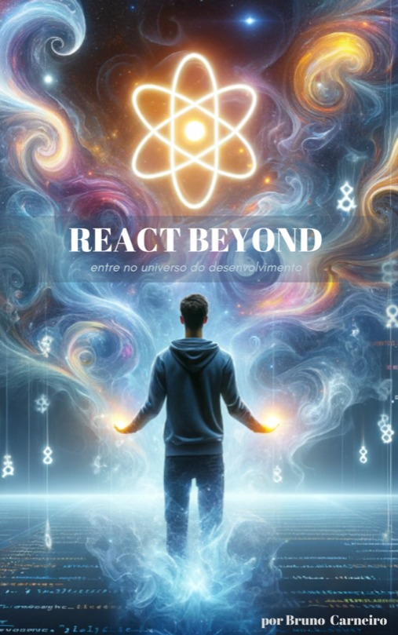

# React Beyond E-Book

@author: Bruno Ferreira Fernandes Carneiro

Este repositório contém os exemplos que foram apresentados no meu e-book **React Beyond**.

Os exemplos estão organizados por capítulos e podem sofrer alterações ao longo do tempo. Além disso, como a tecnologia evolui rapidamente, alguns trechos podem se tornar obsoletos. **Não há garantia de manutenção contínua** deste código.

São mais de 100 snippets de código onde todo o detalhamento do seu funcionamento consta no meu e-book.

## Capítulos aqui apresentados:

* [Capítulo I](./capitulo-01/)
* [Capítulo II](./capitulo-02/)
* [Capítulo III](./capitulo-03/)
* [Capítulo IV](./capitulo-04/)
* [Capítulo V](./capitulo-05/)
* [Capítulo VI](./capitulo-06/)
* [Capítulo VII](./capitulo-07/)
* [Capítulo VIII](./capitulo-08/)
* [Capítulo IX](./capitulo-09/)
* [Capítulo X](./capitulo-10/)

